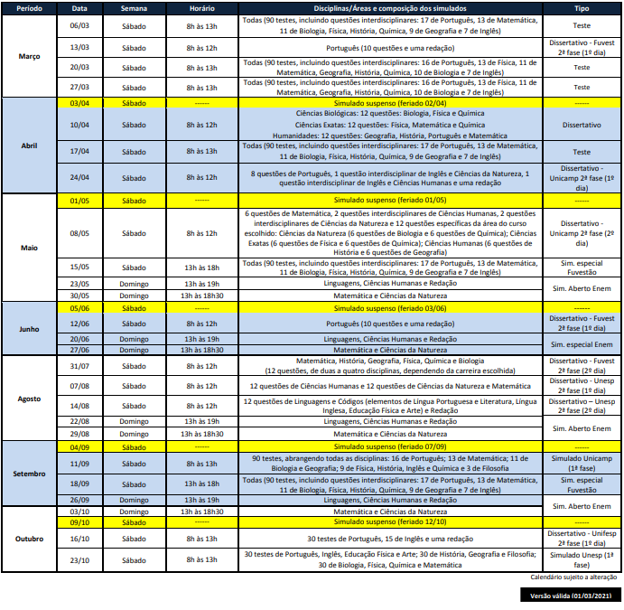

<!DOCTYPE html>
<html lang="pt-br">

<head>
    <link rel="icon" href="favicon.ico">
    <meta charset="UTF-8">
    <meta name="viewport" content="width=device-width, initial-scale=1.0">
    <link href="https://cdn.jsdelivr.net/npm/bootstrap@5.0.0-beta3/dist/css/bootstrap.min.css" rel="stylesheet" integrity="sha384-eOJMYsd53ii+scO/bJGFsiCZc+5NDVN2yr8+0RDqr0Ql0h+rP48ckxlpbzKgwra6" crossorigin="anonymous">
    
    
    
    
    <title>Objetivo</title>
</head>

<body class="px-4 pt-4">
  

    <h4>Link e informações importantes </h4>
    <button type="button" class="btn-close" data-bs-dismiss="alert" aria-label="Close"></button>
  

  

    

        <h2 class="accordion-header" id="headingOne">
          <button class="accordion-button" type="button" data-bs-toggle="collapse" data-bs-target="#collapseOne" aria-expanded="true" aria-controls="collapseOne">
            Horário Aulas
          </button>
        </h2>
        

          

            <table class="table table-striped table-bordered" id="aula" onclick="meet('rrq-pucg-oqo')">
              <thead>
                <tr>
                  <th scope="col">Horário</th>
                  <th scope="col">Segunda</th>
                  <th scope="col">Terça</th>
                  <th scope="col">Quarta</th>
                  <th scope="col">Quinta</th>
                  <th scope="col">Sexta</th>
                </tr>
              </thead>
              <tbody>
                <tr>
                  <th scope="row">18:45 - 19:30</th>
                  <td>História I</td>
                  <td>Geografia</td>
                  <td>Redação</td>
                  <td>Biologia</td>
                  <td>Química I-II</td>
                </tr>
                <tr>
                  <th scope="row">19:30 - 20:15</th>
                  <td>História I</td>
                  <td>Geografia</td>
                  <td>Literatura</td>
                  <td>Biologia</td>
                  <td>Matemática</td>
                </tr>
                <tr>
                  <th scope="row">20:15 - 21:00</th>
                  <td>Química I-II</td>
                  <td>Geografia</td>
                  <td>Literatura</td>
                  <td>Física I-III</td>
                  <td>Matemática</td>
                </tr>
                <tr>
                  <th scope="row">21:00 - 21:20</th>
                  <td>Intervalo</td>
                  <td>Intervalo</td>
                  <td>Intervalo</td>
                  <td>Intervalo</td>
                  <td>Intervalo</td>
                </tr>
                <tr>
                  <th scope="row">21:20 - 22:05</th>
                  <td>Física II</td>
                  <td>História II</td>
                  <td>Matemática</td>
                  <td>Biologia</td>
                  <td>Química III</td>
                </tr>
                <tr>
                  <th scope="row">22:05 - 22:50</th>
                  <td>Gramática</td>
                  <td>Inglês</td>
                  <td>Matemática</td>
                  <td>Física I-III</td>
                  <td>Filosofia/Sociologia</td>
                </tr>
              </tbody>
            </table>
          

        

    

    

        <h2 class="accordion-header" id="headingTwo">
          <button class="accordion-button collapsed" type="button" data-bs-toggle="collapse" data-bs-target="#collapseTwo" aria-expanded="false" aria-controls="collapseTwo">
            Horário Plantões
          </button>
        </h2>
        

          

            <table class="table table-sm table-striped table-bordered">
              <thead>
                <tr>
                  <th scope="col">Disciplina</th>
                  <th scope="col">Segunda</th>
                  <th scope="col">Terça</th>
                  <th scope="col">Quarta</th>
                  <th scope="col">Quinta</th>
                  <th scope="col">Sexta</th>
                </tr>
              </thead>
              <tbody>
                <tr>
                  <th id="disciplina" scope="row" onclick="meet('rwj-dgoj-kii')">Linguagens</th>
                  <td>----</td>
                  <td>----</td>
                  <td>
18:00 - 18:45
</td>
                  <td>----</td>
                  <td>----</td>
                </tr>
                <tr>
                  <th id="disciplina" scope="row" onclick="meet('ukv-hpzd-tua')">Biologia</th>
                  <td>----</td>
                  <td>18:00 - 18:50</td>
                  <td>
14:00 - 15:40

16:00 - 17:40

18:00 - 18:50
</td>
                  <td>
14:00 - 15:40

16:00 - 17:40

18:00 - 18:50
</td>
                  <td>----</td>
                </tr>
                <tr>
                  <th id="disciplina" scope="row" onclick="meet('idj-stfb-zaz')">Física</th>
                  <td>
14:00 - 15:40

16:00 - 17:40
</td>
                  <td>----</td>
                  <td>
14:00 - 15:40

16:00 - 17:40
</td>
                  <td>----</td>
                  <td>16:00 - 18:50</td>
                </tr>
                <tr>
                  <th id="disciplina" scope="row" onclick="meet('bme-tojn-ukh')">Geografia</th>
                  <td>
14:00 - 15:40

16:00 - 17:40

18:00 - 18:50
</td>
                  <td>----</td>
                  <td>----</td>
                  <td>----</td>
                  <td>----</td>
                </tr>
                <tr>
                  <th id="disciplina" scope="row" onclick="meet('qtt-fwgz-wiy')">História</th>
                  <td>----</td>
                  <td>
14:00 - 15:40

16:00 - 17:40

18:00 - 18:50
</td>
                  <td>----</td>
                  <td>----</td>
                  <td>----</td>
                </tr>
                <tr>
                  <th id="disciplina" scope="row" onclick="meet('ref-ozbk-ifh')">Matemática</th>
                  <td>
18:00 - 18:50
</td>
                  <td>----</td>
                  <td>
14:00 - 15:40

16:00 - 17:40

18:00 - 18:50
</td>
                  <td>
14:00 - 15:40

16:00 - 17:40

18:00 - 18:50
</td>
                  <td>
14:00 - 15:40

18:00 - 18:50
</td>
                </tr>
                <tr>
                  <th id="disciplina" scope="row" onclick="meet('dcq-hvzf-qar')">Química</th>
                  <td>
14:00 - 15:40

16:00 - 17:40

18:00 - 18:50
</td>
                  <td>
14:00 - 15:40

16:00 - 17:40

18:00 - 18:50
</td>
                  <td>
14:00 - 15:40

16:00 - 17:40

18:00 - 18:50
</td>
                  <td>
14:00 - 15:40
</td>
                  <td>
14:00 - 15:40

16:00 - 17:40

18:00 - 18:50
</td>
                </tr>
              </tbody>
            </table>
          

        

    

    

      <h2 class="accordion-header" id="headingThree">
        <button class="accordion-button collapsed" type="button" data-bs-toggle="collapse" data-bs-target="#collapseThree" aria-expanded="false" aria-controls="collapseThree">
          Simulados
        </button>
      </h2>
      

        

          
        

      

    

  

</body>

</html>